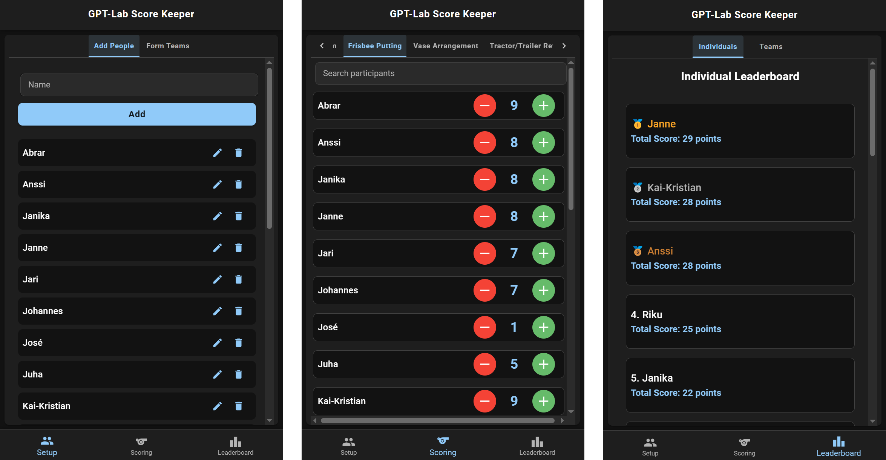

# GPT-Lab Score Keeper

A mobile-friendly web application for tracking scores and standings across multiple sporting events. Designed for use at GPT Lab team events, this app provides an intuitive interface for managing participants, recording scores in real-time, and viewing live leaderboards.



## 🎯 What is This?

GPT-Lab Score Keeper is a digital scoreboard built to coordinate multi-sport competitions where you need to:

- Track individual and team performance across multiple sports
- Update scores quickly from any mobile device
- View live rankings as events progress
- Manage participants and team formations

The application was built with simplicity and speed in mind — perfect for fun team-building events where you want to focus on the activities, not wrestling with complicated scoring tools.

## 🏆 Key Features

### Three Main Sections

**Setup** (Admin Access Required)

- **Add People**: Register all participants for the event
- **Form Teams**: Create teams and assign members

**Scoring** (Real-time Updates)

- Score tracking across seven different sports:
  - Stick Javelin
  - Mölkky
  - Hutunkeitto
  - Brown Water Swim
  - Frisbee Putting
  - Vase Arrangement
  - Tractor/Trailer Reversing
- Simple +/- buttons for quick score entry
- Live updates across all devices (3-second polling)
- Search/filter participants for fast access

**Leaderboards** (Live Rankings)

- **Individual Standings**: See who's leading overall
- **Team Standings**: Track which team is winning
- Automatic calculation of totals across all sports

### Mobile-First Design

- Optimized for phones and tablets
- Bottom navigation bar for quick page switching
- Touch-friendly controls with large buttons
- Works seamlessly across multiple devices simultaneously

### Admin Protection

- PIN-protected setup pages prevent accidental changes
- Anyone can score, but only admins can modify participants and teams
- Simple session-based authentication

## 🛠️ Technology Overview

**Frontend**

- React with Vite for fast development
- Material-UI (MUI) for clean, responsive design
- Mobile-optimized layout with bottom navigation

**Backend**

- json-server providing a simple REST API
- JSON file-based data storage
- Easy to backup and reset

**Deployment**

- Docker containers for both frontend and backend
- docker-compose for simple orchestration
- Portable and easy to run on any machine (including Raspberry Pi)

## 🚀 Getting Started

### Using Docker (Recommended)

```bash
docker-compose up
```

Then open your browser to `http://localhost:3000`

### Manual Setup

**Backend:**

```bash
cd backend
npm install
npm start
```

**Frontend:**

```bash
cd frontend
npm install
npm run dev
```

## 📱 How to Use

1. **First Time Setup**
   - Navigate to the Setup page
   - Enter admin PIN (stored in localStorage)
   - Add all participants in "Add People"
   - Create teams in "Form Teams"

2. **During Events**
   - Switch to the Scoring page
   - Select the current sport from tabs
   - Use +/- buttons to update scores in real-time
   - Scores automatically sync across all devices

3. **View Results**
   - Check the Leaderboard page anytime
   - Toggle between Individual and Team views
   - Rankings update automatically as scores change

## 🎮 Use Cases

This app is perfect for:

- Company team-building events
- Sports days with multiple activities
- Fun competitions at conferences or retreats
- Any scenario where you need quick, collaborative scoring across multiple events

## 📂 Project Structure

```
gpt-lab-score-keeper/
├── frontend/          # React + Vite application
│   ├── src/
│   │   ├── components/   # Reusable UI components
│   │   ├── pages/        # Main page views
│   │   └── api.js        # Backend communication
│   └── Dockerfile
├── backend/           # json-server API
│   ├── db.json         # Data storage
│   └── Dockerfile
└── docker-compose.yml  # Container orchestration
```

## 🔒 Data & Privacy

- All data is stored locally in `backend/db.json`
- No external services or databases required
- Easy to export, backup, or reset data by copying the JSON file
- Perfect for isolated networks or offline events

## 🤝 Contributing

This is a simple, purpose-built tool for GPT Lab events. Feel free to fork and adapt it for your own use cases!

## 📄 License

See [LICENSE](LICENSE) file for details.
